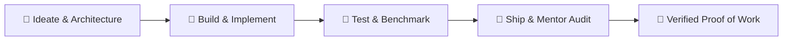

  <h1>⚡ CoLab Nation</h1>
  <h3><strong>Build · Ship · Get Hired</strong></h3>
  
<em>Where builders ship real work, earn mentor verification, and land careers on proof — not paper.</em>

  

    
    
    
  

---

## 🌟 The CoLab Nation Mission

In traditional hiring, résumés and pedigree often overshadow real-world capability. **CoLab Nation** flips the script:

1. 🔨 **Build Real Systems**: Create production-grade distributed architectures, AI workflows, full-stack applications, and scalable developer tooling.
2. 🎓 **Mentor Audits & Verification**: Receive rigorous architecture reviews and PR feedback from industry mentors.
3. 💼 **Proof of Work Hiring**: Showcase transparent, audited code contributions and real-time proof of engineering competence.

---

## 🏛️ Strategic Engineering Tracks

### 🔹 Active Tracks & Focus Areas

| Track | Stack & Technologies | Focus & Real-World Impact |
|:---|:---|:---|
| **Full-Stack & Cloud Systems** | TypeScript, React, Next.js, Go, Node.js | Responsive frontends, performant microservices, and edge-deployed web apps. |
| **DevOps & Testing Infrastructure** | Docker, GitHub Actions, Keploy, Redis | Test case generation, mock recording, automated CI/CD pipelines, and benchmarking. |
| **AI Workflows & Automation** | Python, LLM Orchestration, Prompt Engineering | Scalable autonomous agents, deterministic evaluation, and domain integrations. |

---

## 🛠️ Community Standards & Quality Bar

Every repository and pull request under **CoLab Nation** adheres to strict open-source engineering standards:

- ✅ **Clean Code Architecture**: Adherence to SOLID principles, modular abstractions, and standard linters.
- 🧪 **Comprehensive Automated Testing**: Unit, integration, and contract tests for all critical user and data paths.
- 📝 **Developer Certificate of Origin (DCO)**: Signed-off commits ensuring copyright compliance and code provenance.
- 🤝 **Constructive Peer Reviews**: Thorough, structured code reviews on every proposed change.

---

## 🚀 How to Get Started

- 🌐 **Join the Cohorts**: Visit [colabnation.live](https://www.colabnation.live/) to register for active builder cohorts and tracks.
- 📖 **Contribution Guidelines**: Read our [Community Contribution Guide](https://github.com/Colab-Nation/.github/blob/main/CONTRIBUTING.md).
- 💬 **Get in Touch**: Connect with founders and mentors via [Kartik Chilkoti](https://github.com/chilkotiKartik).

---

  
<strong>CoLab Nation Ecosystem</strong> • <em>Empowering the Next Generation of Engineers Worldwide</em>

  © 2026 CoLab Nation. All rights reserved.

